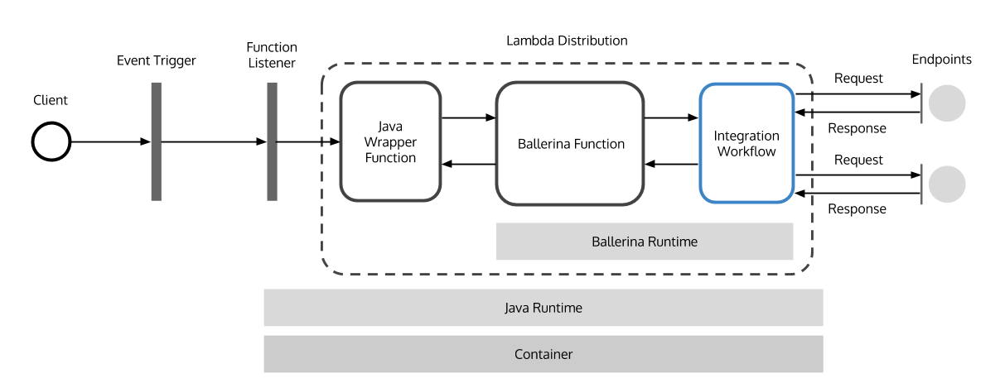

# AWS Lambda Ballerina Runtime

Currently, AWS Lambda only supports Node.js, Python, Java and C#. For enabling any other runtime on AWS Lambda 
a wrapper function can be implemented in one of the above languages. This project provides Java wrapper 
functions for supporting Ballerina functions on AWS Lambda via different trigger sources.

## Deployment Architecture



The above diagram illustrates the deployment architecture of AWS Lambda Ballerina Runtime. The Java wrapper function implements ```com.amazonaws.services.lambda.runtime.RequestStreamHandler``` interface provided by AWS Lambda SDK for handling function requests. Currently, it has been implemented for exposing Lambda functions via the AWS API Gateway.

## Background Information

Please refer the following article for detailed information on this topic:
https://medium.com/ballerinalang/implementing-serverless-functions-with-ballerina-on-aws-lambda-7a325ddf810d

## Quick Start

1. Clone this project:
   
   ```bash
   $ git clone https://github.com/imesh/aws-lambda-ballerina-runtime
   ```

2. Download and extract Ballerina runtime distribution:
   
   ```bash
   $ cd aws-lambda-ballerina-runtime
   $ wget http://ballerinalang.org/downloads/ballerina-runtime/ballerina-<version>.zip
   $ unzip ballerina-<version>.zip
   ```

3. Remove Ballerina zip file, version from the Ballerina folder name and the samples folder:
   
   ```bash
   $ rm ballerina-<version>.zip
   $ mv ballerina-<version>/ ballerina/
   $ rm -rf ballerina/samples/
   ```

4. Copy the Ballerina main function file to the project root folder:
   
   ```bash
   $ cp /path/of/bal/file/ /path/to/aws-lambda-ballerina-runtime/
   ```
   
   For an example if the Ballerina file name is "function.bal", the project folder may look as follows:
   
   ```bash
   $ ls
   README.md     ballerina/    build/        build.gradle  function.bal     src/
   ```

5. Build project using Gradle:
   
   ```bash
   gradle build
   ```

6. Upload build/distributions/aws-lambda-ballerina-runtime.zip file to AWS Lambda. If the zip file is larger than 10 MB, AWS recommends uploading via S3.

7. Set the handler name as follows and execute a test:
   
   ```
   org.ballerina.aws.lambda.runtime.ApiGatewayFunctionInvoker::handleRequest
   ```
   
   ```bash
   START RequestId: 674afc88-5641-11e7-b821-a148953e4faa Version: $LATEST
   Request received: {body={hello=ballerina}}
   Executing command: cp -r ballerina /tmp/ballerina
   Command executed in 27 ms, exit code: 0
   Executing command: cp echo.bal /tmp/echo.bal
   Command executed in 1 ms, exit code: 0
   Message body: {"hello":"ballerina"}
   Executing command: /tmp/ballerina/bin/ballerina run main /tmp/echo.bal {"hello":"ballerina"}
   Output: {"hello":"ballerina"}
   Command executed in 2226 ms, exit code: 0
   END RequestId: 674afc88-5641-11e7-b821-a148953e4faa
   REPORT RequestId: 674afc88-5641-11e7-b821-a148953e4faa	Duration: 2281.62 ms	Billed Duration: 2300 ms 	Memory Size: 1536 MB	Max Memory Used: 196 MB
   ```

## References
- [Scripting Languages for AWS Lambda: Running PHP, Ruby, and Go](https://aws.amazon.com/blogs/compute/scripting-languages-for-aws-lambda-running-php-ruby-and-go/)
   
## License
Apache 2.0
